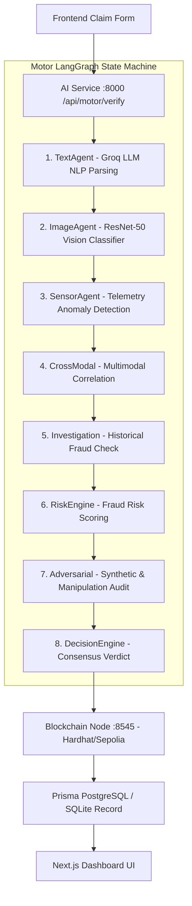
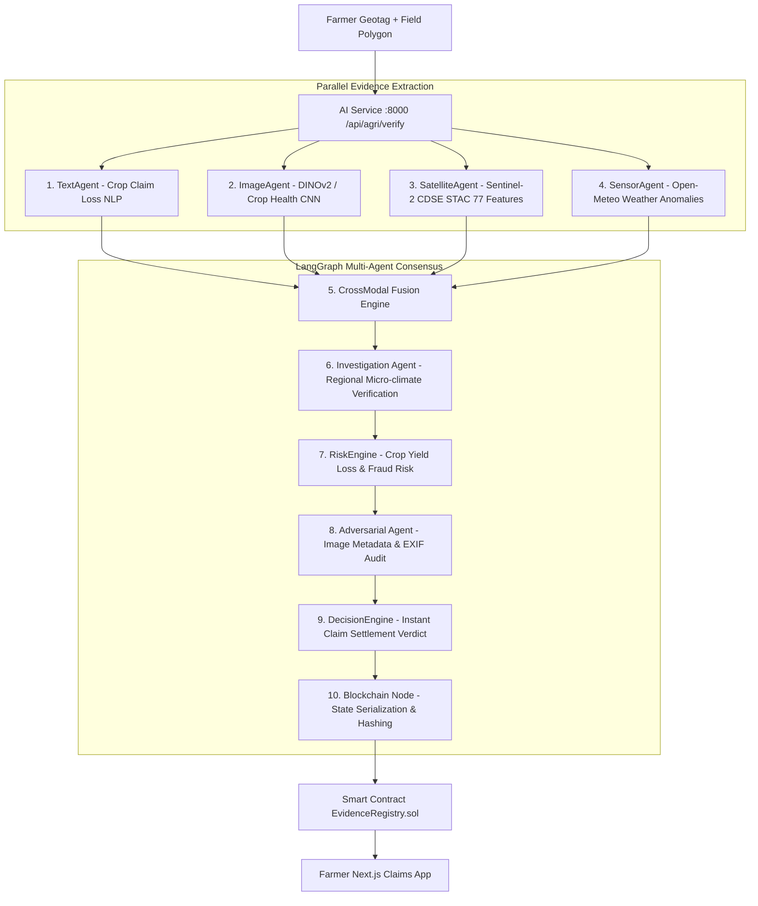

# 🛡️ TruthChain 2.0 — Multimodal AI & Blockchain Insurance Consensus Engine

TruthChain 2.0 is an enterprise-grade, multi-agent AI and Web3 blockchain consensus platform designed for automated, fraud-proof claim evaluation across two major domains:
1. 🚗 **Motor Insurance** (Vehicle Damage & Telematics Analysis)
2. 🌾 **Agriculture Insurance** (Crop Health, Sentinel-2 Satellite Multispectral & Weather Analysis)

---

## ⚡ Quick Start & Startup Commands

To run the complete TruthChain system locally, open **4 separate terminals** and run each service in the following order:

### 1️⃣ Blockchain Node (Hardhat Local Network)
```bash
cd blockchain
npm install
npx hardhat node
```
- **URL / RPC**: `http://127.0.0.1:8545`
- **Chain ID**: `31337`
- *Deploy Smart Contracts (Terminal 1 or separate)*:
  ```bash
  npx hardhat run scripts/deploy.ts --network localhost
  ```

---

### 2️⃣ Backend API (`/backend`)
```bash
cd backend
npm install
npm run dev
```
- **URL**: `http://localhost:4000`
- **Features**: Prisma ORM, Auth middleware, Database CRUD, Claim Management.

---

### 3️⃣ AI Services Engine (`/ai-services`)
```bash
cd ai-services
pip install -r requirements.txt
uvicorn server:app --reload --port 8000
```
- **URL**: `http://localhost:8000`
- **Swagger Docs**: `http://localhost:8000/docs`
- **Features**: LangGraph multi-agent orchestration for both Motor (8 agents) & Agriculture (10 agents) domains, CDSE Sentinel-2 STAC API integration, DINOv2 vision models, and consensus evaluators.

---

### 4️⃣ Frontend Web App (`/frontend`)
```bash
cd frontend
npm install
npm run dev
```
- **URL**: `http://localhost:3000`
- **Features**: Next.js 16 (App Router), Interactive Leaflet map & draw polygon tool, real-time agent execution timeline, domain selector (`motor` vs `agriculture`), and blockchain transaction audit receipts.

---

## 🔄 Multi-Domain Consensus Workflows

### 🚗 1. Motor Insurance Workflow (Sequential Pipeline)
8 specialized agents process claim text, damage images, and telematics sequentially:


### 🌾 2. Agriculture Insurance Workflow (Parallel Fan-out + Satellite)
10 specialized agents assess crop photos, satellite multispectral bands, and historical weather:


---

## 🤖 Pre-Trained Models Included

The repository includes pre-trained machine learning models:
- **Vehicle Damage Classifier (Vision)**: `ai-services/ml/models/vision/`
- **Vehicle Sensor Anomaly Detection (Isolation Forest)**: `ai-services/ml/models/sensor/sensor_isolationforest_v2.pkl`
- **Crop Disease & Health Classifier (DINOv2 / CNN)**: `ai-services/ml/models/agriculture/crop/cropagent_rgb_dinov2_v0.2_best.pt`
- **Satellite Evidence Classifier (Random Forest 77 Features)**: `ai-services/ml/models/agriculture/satellite/satellite_evidence_agent_v1_FULL.joblib` & `satellite_cropagent_v0.2.json`
