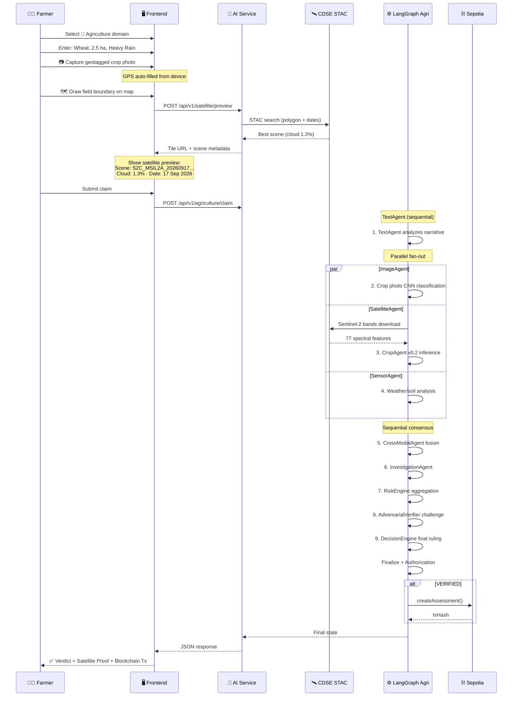
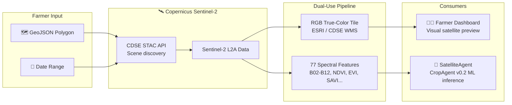

# TruthChain 2.0 — Agriculture Insurance Domain Workflow

## End-to-End Pipeline

```mermaid
flowchart TB
    subgraph FRONTEND["🖥️ Frontend · Next.js :3000"]
        F1["Claim Form<br/>page.tsx /claims/new"]
        F2["Domain Selector<br/>🌾 Agriculture Insurance"]
        F3["Crop & Field Info<br/>Crop type, area, peril event"]
        F4["📷 Geotagged Camera<br/>Live photo capture + GPS coords"]
        F5["🗺️ Satellite Map Draw<br/>Draw field polygon on ESRI tiles"]
        F6["🛰️ Confirm Field<br/>→ Fetch Sentinel-2 Preview"]
        F7["POST /api/v1/agriculture/claim"]
    end

    subgraph SAT_PREVIEW["🛰️ Satellite Preview · CDSE STAC"]
        SP1["POST /api/v1/satellite/preview"]
        SP2["CDSE STAC API Query<br/>Sentinel-2 L2A scenes"]
        SP3["Best Scene Selection<br/>Lowest cloud cover"]
        SP4["Return tile_url + metadata<br/>Scene ID, date, cloud%"]
    end

    subgraph AISERVICE["🧠 AI Services · FastAPI :8000"]
        direction TB
        S1["AgricultureClaimRequest Validation"]
        S2["Build claim_data{}<br/>crop, area, weather, field_geojson"]
        S3["UnifiedGraph.invoke()<br/>domain='agriculture' → agri_graph"]
    end

    subgraph LANGGRAPH["⚙️ LangGraph Agriculture Pipeline"]
        direction TB

        A1["1️⃣ TextAgent<br/>Groq LLM · Claim Narrative<br/>→ consistency, red_flags"]

        subgraph PARALLEL["🔀 Parallel Evidence Fan-Out"]
            direction LR
            A2["2️⃣ ImageAgent<br/>Crop Image CNN<br/>→ crop_class, damage_level"]
            A3["3️⃣ SatelliteAgent<br/>CDSE Sentinel-2 · CropAgent v0.2<br/>→ predicted_crop, NDVI, 77-features"]
            A4["4️⃣ SensorAgent<br/>Weather/Soil Analysis<br/>→ rainfall, soil_moisture, anomaly"]
        end

        subgraph SEQUENTIAL["🔗 Sequential Consensus"]
            A5["5️⃣ CrossModalAgent<br/>Groq LLM Multi-Evidence Fusion<br/>→ image↔satellite↔weather alignment"]
            A6["6️⃣ InvestigationAgent<br/>Groq LLM Deep Investigation<br/>→ field_visit_priority, fraud_indicators"]
            A7["7️⃣ RiskEngine<br/>Weighted Risk Aggregation<br/>→ fraud_score, risk_level"]
            A8["8️⃣ AdversarialVerifier<br/>Groq LLM Challenge Layer<br/>→ adversarial_result, weaknesses"]
            A9["9️⃣ DecisionEngine<br/>Final Automated Screening<br/>→ final_decision, payout_recommendation"]
        end

        subgraph FINALIZE["🔒 Finalization"]
            FN1["Finalize Node<br/>Consistency + fail-closed gate"]
            FN2["final_verdict = VERIFIED | REJECTED | FLAGGED"]
        end

        subgraph BLOCKCHAIN_GATE["⛓️ Blockchain Authorization"]
            BG1{"blockchain_allowed?"}
            BG2["Blockchain Certificate Node<br/>Register on Sepolia"]
            BG3["Skip — Assessment denied"]
        end
    end

    subgraph BLOCKCHAIN["⛓️ Blockchain · Sepolia"]
        BC1["AssessmentRegistry.sol<br/>0x6245...bB3B"]
        BC2["createAssessment()"]
        BC3["On-chain Tx Hash<br/>Immutable proof"]
    end

    subgraph SENTINEL["🛰️ Sentinel-2 Data Architecture"]
        direction LR
        SE1["SENTINEL-2 DATA"]
        SE2["RGB Visualization<br/>→ Farmer Dashboard"]
        SE3["77 Spectral Features<br/>→ CropAgent v0.2 ML"]
    end

    subgraph RESULT["📊 Result Display"]
        R1["Claims Detail Page<br/>/claims/[id]"]
        R2["Verdict + Fraud Score"]
        R3["10 Agent Reports"]
        R4["Satellite Evidence"]
        R5["Blockchain Certificate"]
    end

    F1 --> F2 --> F3 --> F4 --> F5 --> F6
    F6 -->|"GeoJSON polygon"| SP1
    SP1 --> SP2 --> SP3 --> SP4
    SP4 -->|"Satellite tile + scene metadata"| F6
    F6 --> F7

    F7 -->|"HTTP POST JSON"| S1
    S1 --> S2 --> S3

    S3 --> A1
    A1 --> A2 & A3 & A4
    A2 --> A5
    A3 --> A5
    A4 --> A5
    A5 --> A6 --> A7 --> A8 --> A9
    A9 --> FN1 --> FN2
    FN2 --> BG1

    BG1 -->|"Yes · VERIFIED"| BG2
    BG1 -->|"No · REJECTED"| BG3

    BG2 --> BC1 --> BC2 --> BC3
    BC3 -->|"certificate{}"| R1
    BG3 -->|"No certificate"| R1

    SE1 --> SE2 & SE3
    SE2 -.->|"Preview image"| F6
    SE3 -.->|"ML input"| A3

    R1 --> R2 & R3 & R4 & R5

    classDef frontend fill:#0e4d92,color:#fff,stroke:#1e90ff
    classDef aiservice fill:#1a1a2e,color:#fff,stroke:#00d4ff
    classDef agent fill:#0d2137,color:#67e8f9,stroke:#22d3ee
    classDef parallel fill:#1a2e1a,color:#6ee7b7,stroke:#10b981
    classDef blockchain fill:#2d1b4e,color:#c084fc,stroke:#a855f7
    classDef satellite fill:#1b2d4e,color:#93c5fd,stroke:#3b82f6
    classDef result fill:#064e3b,color:#6ee7b7,stroke:#10b981

    class F1,F2,F3,F4,F5,F6,F7 frontend
    class S1,S2,S3 aiservice
    class A1,A5,A6,A7,A8,A9 agent
    class A2,A3,A4 parallel
    class BC1,BC2,BC3,BG1,BG2,BG3 blockchain
    class SP1,SP2,SP3,SP4,SE1,SE2,SE3 satellite
    class R1,R2,R3,R4,R5,FN1,FN2 result
```



---

## Agent Details

| # | Agent | Model / Technology | Input | Output |
|---|-------|-------------------|-------|--------|
| 1 | **TextAgent** | Groq Llama-3 LLM | Claim narrative text | `consistency`, `red_flags[]`, `narrative_score` |
| 2 | **ImageAgent** ⚡ | Crop Image CNN (`agriculture/image/`) | Geotagged crop photo | `crop_classification`, `damage_level`, `confidence` |
| 3 | **SatelliteAgent** ⚡ | Satellite CropAgent v0.2 + CDSE STAC | `field_geojson`, date range | `predicted_crop`, `top_probability`, `NDVI`, `evidence_decision` |
| 4 | **SensorAgent** ⚡ | Weather/Soil data analysis | `rainfall_mm`, `soil_moisture`, `temperature` | `weather_anomaly_score`, `drought/flood_flag` |
| 5 | **CrossModalAgent** | Groq Llama-3 LLM | All parallel agent reports | `cross_modal_score`, `image↔satellite alignment` |
| 6 | **InvestigationAgent** | Groq Llama-3 LLM | Cross-modal + risk signals | `fraud_indicators[]`, `field_visit_priority` |
| 7 | **RiskEngine** | Weighted aggregation | All agent scores | `fraud_score` (0-100), `risk_level` |
| 8 | **AdversarialVerifier** | Groq Llama-3 LLM | Full evidence chain | `adversarial_result`, `vulnerabilities[]` |
| 9 | **DecisionEngine** | Rule + ML hybrid | All evidence + risk | `final_decision`, `payout_recommendation`, `confidence` |
| — | **Finalize** | Integrity gate | Decision output | `final_verdict: VERIFIED / REJECTED / FLAGGED` |
| — | **BlockchainCertificate** | Ethers.js + Sepolia | Verified verdict | `tx_hash`, `block_number`, `certificate{}` |

> ⚡ = Runs in **parallel** (LangGraph fan-out → fan-in)

---

## Farmer Experience Flow



---

## Sentinel-2 Dual-Use Architecture



---

## Key Differences: Agriculture vs Motor

| Feature | Motor | Agriculture |
|---------|-------|-------------|
| **Agents** | 8 sequential | 10 (1 sequential → 3 parallel → 5 sequential) |
| **Evidence Source** | Vehicle photo, OBD telemetry | Crop photo, satellite imagery, weather data |
| **Satellite** | Not used | CDSE Sentinel-2 + CropAgent v0.2 |
| **Parallel Execution** | No | Yes (ImageAgent ‖ SatelliteAgent ‖ SensorAgent) |
| **Extra Agents** | — | InvestigationAgent, DecisionEngine |
| **ML Models** | ResNet-50 (vision), XGBoost (sensor) | Crop CNN, CropAgent v0.2 (77 features) |
| **Farmer UX** | Upload photo + narrative | Camera + GPS + polygon draw + satellite preview |
| **External APIs** | Groq LLM | Groq LLM + CDSE STAC + ESRI Tiles |

---

## File Map

```
ai-services/
├── server.py                          # FastAPI endpoints
├── graph/
│   ├── graph.py                       # UnifiedGraph router
│   ├── agri_graph.py                  # Agriculture LangGraph (this pipeline)
│   ├── agri_state.py                  # Agriculture state schema
│   ├── motor_graph.py                 # Motor LangGraph
│   ├── blockchain_node.py             # Sepolia registration node
│   └── state.py                       # Motor state schema
├── agriculture/
│   ├── agents/
│   │   ├── image_agent.py             # Crop image classification
│   │   ├── satellite_agent.py         # CDSE Sentinel-2 evidence
│   │   ├── text_agent.py              # Narrative analysis
│   │   ├── sensor_agent.py            # Weather/soil analysis
│   │   ├── cross_modal_agent.py       # Evidence fusion
│   │   ├── investigation_agent.py     # Deep fraud investigation
│   │   ├── risk_engine.py             # Risk aggregation
│   │   ├── adversarial_verifier.py    # Challenge layer
│   │   └── decision_engine.py         # Final decision
│   ├── satellite/
│   │   ├── stac_client.py             # CDSE STAC scene search
│   │   ├── auth.py                    # CDSE OAuth
│   │   ├── downloader.py              # Sentinel-2 band download
│   │   ├── features.py                # 77-feature extraction
│   │   ├── inference.py               # CropAgent v0.2 model
│   │   ├── evidence.py                # Evidence pipeline
│   │   └── assets.py                  # Asset resolution
│   ├── image/
│   │   └── inference.py               # Crop photo CNN
│   └── core/
│       ├── schemas.py                 # Data schemas
│       ├── constants.py               # Crop/feature constants
│       ├── hashing.py                 # Evidence hashing
│       └── errors.py                  # Error types
└── models/agriculture/
    ├── crop/                          # Crop classification model
    └── satellite/                     # CropAgent v0.2 weights
```
