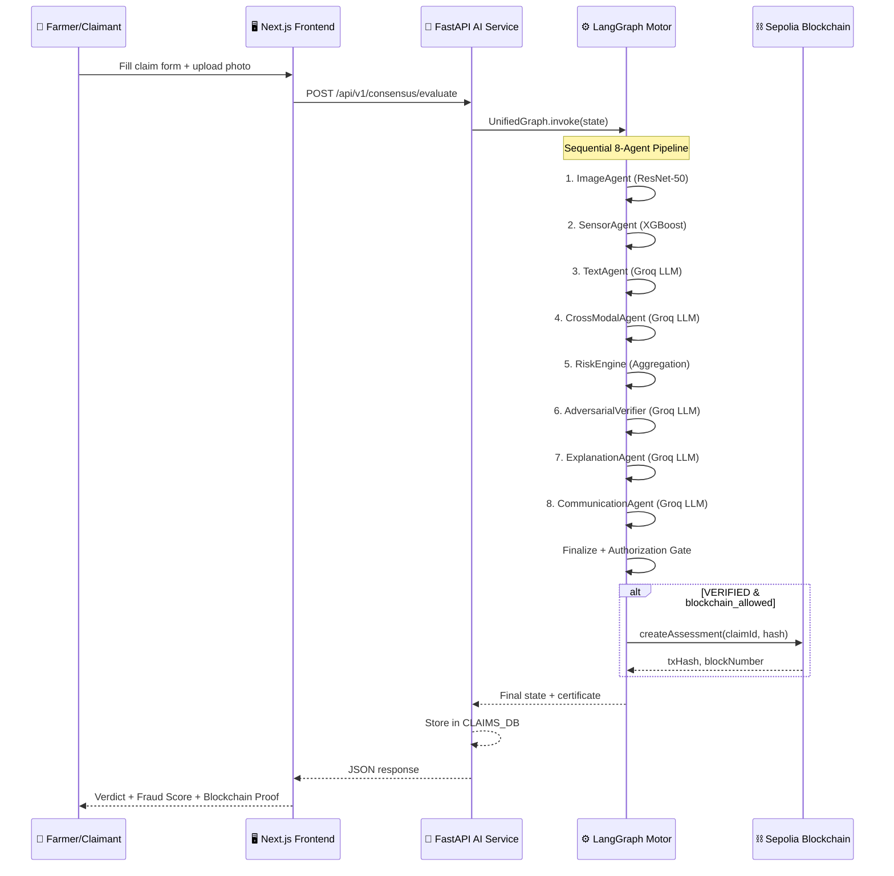

# TruthChain 2.0 — Motor Insurance Domain Workflow

## End-to-End Pipeline

```mermaid
flowchart TB
    subgraph FRONTEND["🖥️ Frontend · Next.js :3000"]
        F1["Claim Form<br/>page.tsx /claims/new"]
        F2["Domain Selector<br/>🚗 Motor Insurance"]
        F3["Upload Damage Photo<br/>JPG/PNG/WEBP ≤10MB"]
        F4["Sensor Telemetry<br/>Speed, Accel XYZ, GPS"]
        F5["Claimant Narrative<br/>Incident description text"]
        F6["POST /api/v1/consensus/evaluate"]
    end

    subgraph AISERVICE["🧠 AI Services · FastAPI :8000"]
        direction TB
        S1["ConsensusRequest Validation<br/>Pydantic schema + CORS"]
        S2["_build_graph_state()<br/>Normalize: text, image, sensor"]
        S3["UnifiedGraph.invoke()<br/>domain='motor' → motor_graph"]
    end

    subgraph LANGGRAPH["⚙️ LangGraph Motor Pipeline"]
        direction TB

        subgraph AGENTS["8-Agent Sequential Chain"]
            A1["1️⃣ ImageAgent<br/>ResNet-50 Vehicle Damage CNN<br/>→ damage_type, severity, confidence"]
            A2["2️⃣ SensorAgent<br/>XGBoost Telemetry Model<br/>→ anomaly_score, impact_vector"]
            A3["3️⃣ TextAgent<br/>Groq LLM · Llama-3<br/>→ narrative_analysis, consistency"]
            A4["4️⃣ CrossModalAgent<br/>Groq LLM Multi-Evidence Fusion<br/>→ cross_modal_score, contradictions"]
            A5["5️⃣ RiskEngine<br/>Weighted Agent Aggregation<br/>→ fraud_score, risk_level"]
            A6["6️⃣ AdversarialVerifier<br/>Groq LLM Adversarial Challenge<br/>→ verified/flagged, challenge_results"]
            A7["7️⃣ ExplanationAgent<br/>Groq LLM Evidence Summary<br/>→ human_readable_explanation"]
            A8["8️⃣ CommunicationAgent<br/>Groq LLM Final Report<br/>→ claim_letter, recommendation"]
        end

        subgraph FINALIZE["🔒 Finalization"]
            FN1["Finalize Node<br/>Consistency check + fail-closed gate"]
            FN2["final_verdict = VERIFIED | REJECTED | FLAGGED"]
        end

        subgraph BLOCKCHAIN_GATE["⛓️ Blockchain Authorization"]
            BG1{"blockchain_allowed?"}
            BG2["Blockchain Certificate Node<br/>Register on Sepolia"]
            BG3["Skip — Assessment denied"]
        end
    end

    subgraph BLOCKCHAIN["⛓️ Blockchain · Sepolia"]
        BC1["AssessmentRegistry.sol<br/>0x6245...bB3B"]
        BC2["createAssessment()"]
        BC3["On-chain Tx Hash<br/>Immutable evidence proof"]
    end

    subgraph RESULT["📊 Result Display"]
        R1["Claims Detail Page<br/>/claims/[id]"]
        R2["Verdict: VERIFIED / REJECTED"]
        R3["Fraud Score: X/100"]
        R4["8 Agent Reports"]
        R5["Blockchain Certificate<br/>Sepolia Tx Link"]
    end

    F1 --> F2 --> F3 --> F4 --> F5 --> F6
    F6 -->|"HTTP POST JSON"| S1
    S1 --> S2 --> S3

    S3 --> A1
    A1 -->|"agent_reports.ImageAgent"| A2
    A2 -->|"agent_reports.SensorAgent"| A3
    A3 -->|"agent_reports.TextAgent"| A4
    A4 -->|"agent_reports.CrossModalAgent"| A5
    A5 -->|"fraud_score, risk_level"| A6
    A6 -->|"adversarial_result"| A7
    A7 -->|"explanation"| A8
    A8 --> FN1
    FN1 --> FN2
    FN2 --> BG1

    BG1 -->|"Yes · VERIFIED"| BG2
    BG1 -->|"No · REJECTED"| BG3

    BG2 --> BC1
    BC1 --> BC2
    BC2 --> BC3
    BC3 -->|"certificate{}"| R1

    BG3 -->|"No certificate"| R1

    R1 --> R2 & R3 & R4 & R5

    classDef frontend fill:#0e4d92,color:#fff,stroke:#1e90ff
    classDef aiservice fill:#1a1a2e,color:#fff,stroke:#00d4ff
    classDef agent fill:#0d2137,color:#67e8f9,stroke:#22d3ee
    classDef blockchain fill:#2d1b4e,color:#c084fc,stroke:#a855f7
    classDef result fill:#064e3b,color:#6ee7b7,stroke:#10b981

    class F1,F2,F3,F4,F5,F6 frontend
    class S1,S2,S3 aiservice
    class A1,A2,A3,A4,A5,A6,A7,A8 agent
    class BC1,BC2,BC3,BG1,BG2,BG3 blockchain
    class R1,R2,R3,R4,R5,FN1,FN2 result
```

---

## Agent Details

| # | Agent | Model / Technology | Input | Output |
|---|-------|-------------------|-------|--------|
| 1 | **ImageAgent** | ResNet-50 CNN (frozen, `models/vision/`) | Vehicle damage photo (base64 or file path) | `damage_type`, `severity`, `confidence`, `is_damaged` |
| 2 | **SensorAgent** | XGBoost (`ml/models/sensor/`) | Speed, Accel XYZ, GPS distance | `anomaly_score`, `impact_magnitude`, `sensor_verdict` |
| 3 | **TextAgent** | Groq Llama-3 LLM | Claimant narrative text | `sentiment`, `consistency_score`, `red_flags[]` |
| 4 | **CrossModalAgent** | Groq Llama-3 LLM | All 3 prior agent reports | `cross_modal_score`, `contradictions[]`, `alignment` |
| 5 | **RiskEngine** | Weighted aggregation engine | All agent scores | `fraud_score` (0-100), `risk_level`, `final_risk` |
| 6 | **AdversarialVerifier** | Groq Llama-3 LLM | Full evidence + RiskEngine result | `verified/flagged`, `challenge_results[]` |
| 7 | **ExplanationAgent** | Groq Llama-3 LLM | All evidence chain | `human_readable_explanation`, `evidence_summary` |
| 8 | **CommunicationAgent** | Groq Llama-3 LLM | Explanation + verdict | `claim_letter`, `recommendation`, `next_steps` |

---

## Data Flow

---

## Technology Stack

| Layer | Technology | Port |
|-------|-----------|------|
| Frontend | Next.js 16.3.5 + Turbopack, React 19, TailwindCSS 4 | `:3000` |
| Backend API | Fastify 5, Prisma 7, Neon PostgreSQL | `:4000` |
| AI Service | FastAPI, LangGraph, PyTorch, Groq LLM | `:8000` |
| Blockchain | Hardhat, Solidity, Ethers.js, Sepolia Testnet | `:8545` |
| ML Models | ResNet-50 (vision), XGBoost (sensor), Satellite CropAgent v0.2 | — |
| LLM Provider | Groq Cloud (Llama-3) | — |
| Database | Neon PostgreSQL (cloud) + SQLite (blockchain audit) | — |
